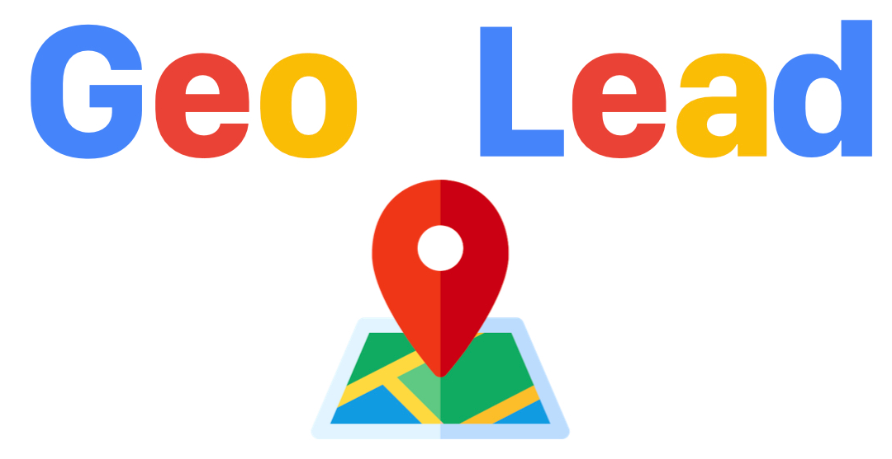

# Thomas Casale

Bienvenue sur mon profil GitHub ! Je suis développeur passionné par [mentionne tes spécialités : web, mobile, data science, etc.]. Toujours en quête d'innovation, je travaille sur des projets pour [explique ta motivation ou ton but].

---

## 🖥 Entrepreneur and developper based in France
- 🚀 Expert in **webscraping** and **grow-hacking**
- 🌱 Currently working on **Geo Lead**

---

## 🔌 Let's connect
- 🔗 Connect with me on LinkedIn 👉 https://www.linkedin.com/in/thomas-casale
- 📩 Send me an email 👉 geolead (at) geoleadfinder.com
---

## 🛠️ My skills

---

## 🌐 My websites
(https://geoleadfinder.com)

---

## 📈 My GitHub Stats

---
